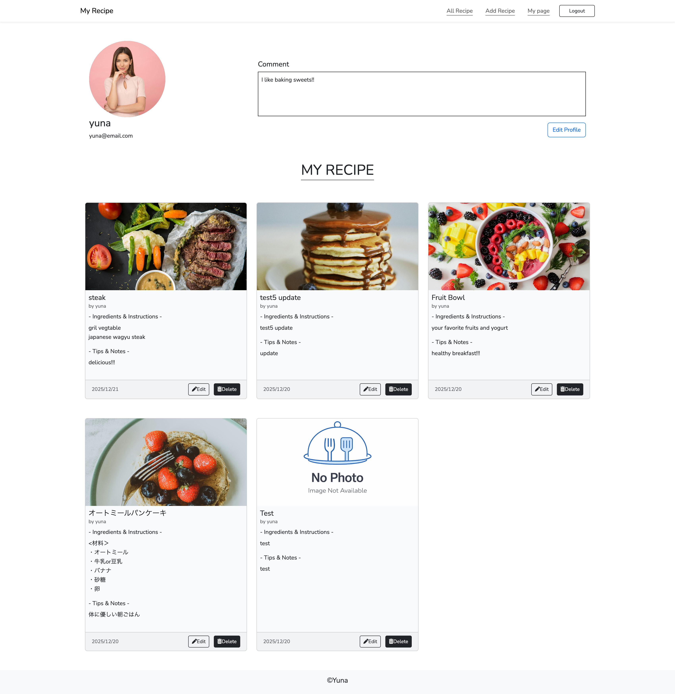
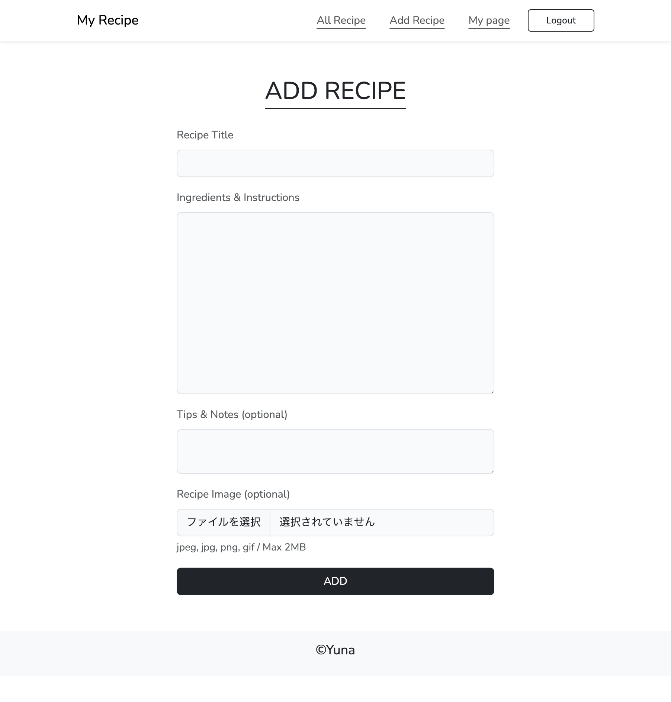
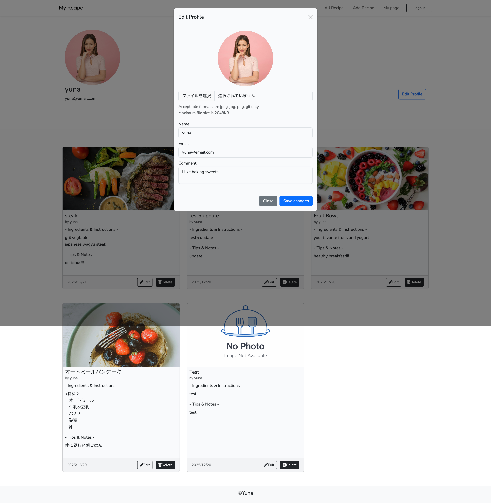

## My Recipe

My Recipe is a personal recipe management web application.
Users can create, edit, and manage their own recipes with images, and organize them in a simple and clean interface.

---

## Features
- User authentication (Sign up / Sign in)
- Create, edit, and delete recipes
- Upload recipe images
- Personal "My Page" to manage your own recipes
- Profile editing with avatar upload

---

## Design

The UI was designed using Figma before and during development.
The design focuses on simplicity and usability, allowing users to manage their recipes intuitively.

### Home


### All Recipes


### My Page


### Add Recipe


### Edit Profile (Modal)


---

## Tech Stack
- Laravel
- PHP
- MySQL
- Bootstrap
- SCSS
- Vite
- Figma

---

## Setup
```bash
git clone https://github.com/your-username/my_recipe.git
cd my_recipe
composer install
npm install
php artisan key:generate
php artisan migrate
php artisan storage:link
npm run dev
php artisan serve

The Laravel framework is open-sourced software licensed under the [MIT license](https://opensource.org/licenses/MIT).
